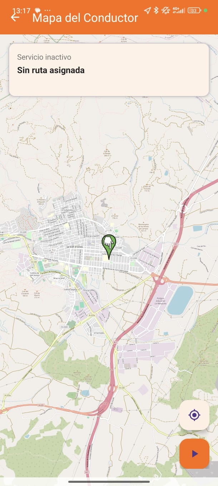
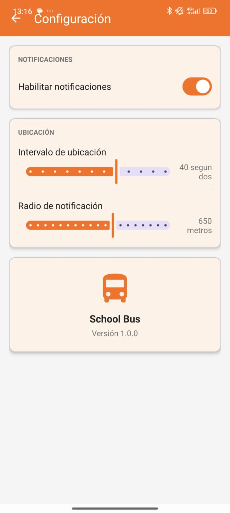
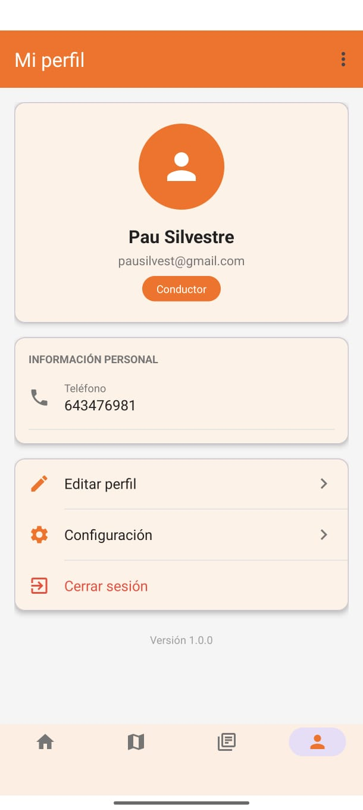
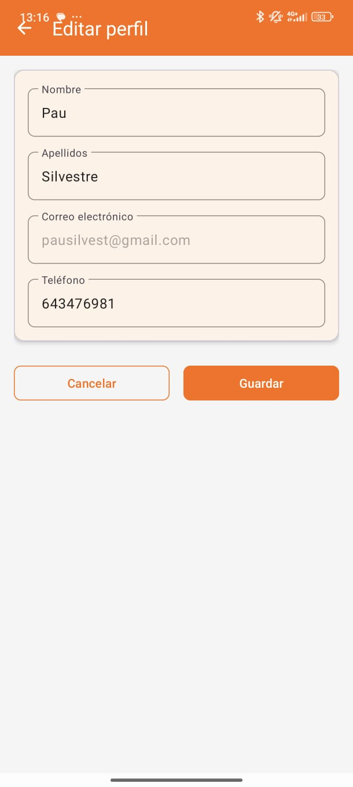
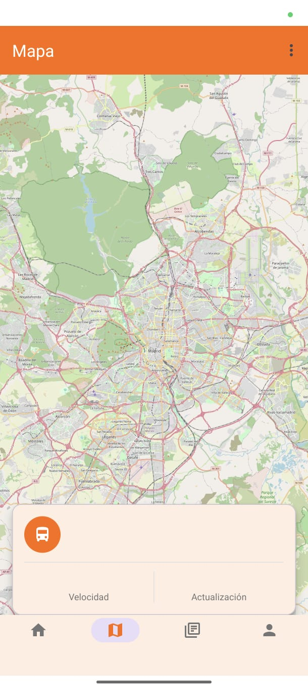
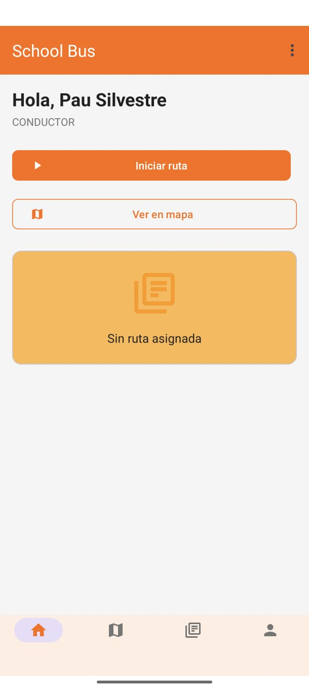
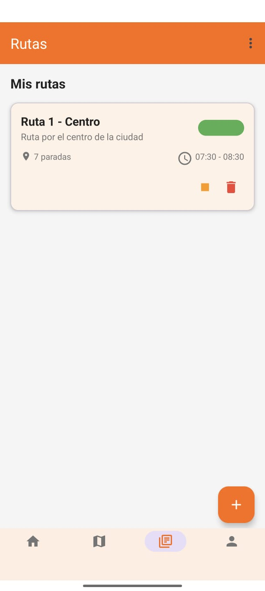

# Memoria del Proyecto Final: School Bus App

**Autoría:** Pau Silvestre Arnandis, Mario Alexandru Mincu y Khadija  
**Curso:** 2DAM  
**Año académico:** 2025/2026

---

## Índice

1. Introducción  
2. Justificación del proyecto  
3. Contexto y problemática detectada  
4. Objetivos del proyecto  
5. Alcance funcional de la aplicación  
6. Análisis de requisitos  
7. Diseño conceptual y experiencia de usuario  
8. Wireframes, mockups y propuesta visual  
9. Arquitectura técnica del sistema  
10. Tecnologías empleadas  
11. Desarrollo implementado en la aplicación Android  
12. Gestión de usuarios y autenticación  
13. Persistencia de datos y modelo de base de datos  
14. Navegación, pantallas y funcionalidades desarrolladas  
15. Prototipo web de apoyo y validación visual  
16. Planificación del proyecto  
17. Análisis de riesgos  
18. Presupuesto y recursos  
19. Estado actual del proyecto  
20. Limitaciones detectadas  
21. Propuestas de mejora y trabajo futuro  
22. Conclusiones  
23. Anexos visuales

---

## 1. Introducción

El presente documento constituye la memoria descriptiva del proyecto **School Bus App**, una aplicación orientada al seguimiento y gestión del transporte escolar mediante dispositivos móviles Android. El objetivo principal de la solución es ofrecer una herramienta que permita mejorar la organización del servicio, la comunicación entre los distintos usuarios implicados y la consulta centralizada de información relacionada con rutas, paradas, usuarios, avisos y seguimiento del autobús.

El proyecto se ha desarrollado como trabajo final del ciclo **2DAM**, dentro del curso académico **2025/2026**, y se plantea como una propuesta realista, escalable y alineada con necesidades del entorno educativo actual. La aplicación combina una parte funcional ya implementada en Android Studio con documentación técnica, diseño visual previo, prototipos de interfaz y una propuesta sólida de base de datos orientada a una versión futura más completa.

A lo largo del repositorio se observa una evolución del proyecto desde la fase de análisis y diseño hasta una fase de implementación práctica. Se incluyen documentos de planificación, análisis de riesgos, presupuesto, diagramas, mockups visuales, wireframes interactivos y una aplicación Android estructurada en Java con persistencia local e integración preparada con Firebase.

Esta memoria recoge tanto la idea general del producto como el trabajo efectivamente realizado, describiendo de forma detallada la solución propuesta, la arquitectura implementada, las funcionalidades desarrolladas, el diseño de las pantallas, el estado actual del proyecto y las posibles líneas de ampliación.

---

## 2. Justificación del proyecto

La gestión del transporte escolar suele depender, en muchos contextos, de canales poco estructurados como llamadas telefónicas, mensajería instantánea o comunicaciones informales entre familias y responsables del servicio. Esta forma de trabajo provoca ineficiencias, falta de trazabilidad, desinformación y dificultades para responder con rapidez ante retrasos, cambios de ruta o incidencias.

En este contexto, el proyecto **School Bus App** surge como respuesta a una necesidad real: disponer de una plataforma móvil desde la que estudiantes, familias y conductores puedan consultar información relevante del servicio de transporte escolar de forma rápida, centralizada y accesible.

La elección del formato de aplicación móvil nativa para Android responde a varios factores:

- El teléfono móvil es el dispositivo de consulta más inmediato para familias y alumnado.
- Android permite trabajar con componentes nativos, notificaciones, almacenamiento local, autenticación y servicios de localización.
- El ecosistema Android ofrece herramientas maduras para construir interfaces, gestionar navegación y escalar el producto con futuras integraciones.
- La app puede evolucionar hacia una solución más robusta conectada a servicios en la nube.

Además de su utilidad práctica, el proyecto resulta especialmente adecuado como trabajo final, ya que permite aplicar contenidos del ciclo formativo relacionados con:

- Programación orientada a objetos.
- Desarrollo de interfaces móviles.
- Gestión de bases de datos.
- Persistencia de datos local y remota.
- Diseño de experiencia de usuario.
- Documentación técnica y planificación de proyectos.

---

## 3. Contexto y problemática detectada

El transporte escolar no consiste únicamente en desplazar alumnado entre su domicilio y el centro educativo. Implica coordinación de rutas, horarios, paradas, listas de estudiantes, vehículos, conductores, incidencias y comunicaciones con familias. Cuando esta gestión se realiza de forma fragmentada, aparecen diversos problemas:

1. **Falta de información centralizada.**  
   Las familias no disponen de un punto único para consultar el estado del servicio.

2. **Dificultad para comunicar incidencias.**  
   Un retraso, un cambio de parada o una incidencia mecánica pueden no llegar a todos los interesados con la rapidez necesaria.

3. **Escasa trazabilidad.**  
   No existe historial estructurado de avisos, rutas, usuarios o eventos del sistema.

4. **Dependencia de la comunicación manual.**  
   Muchas tareas dependen de llamadas o mensajes enviados individualmente.

5. **Inseguridad percibida por las familias.**  
   La falta de visibilidad sobre el trayecto y la ubicación del autobús genera incertidumbre.

El repositorio muestra que el proyecto ha sido concebido precisamente para abordar estas dificultades desde una perspectiva tecnológica. Ya desde la propuesta inicial se identifican claramente los roles de usuario y los módulos principales: inicio de sesión, gestión de usuarios, mapa del conductor, mapa del estudiante/padre y gestión de rutas.

---

## 4. Objetivos del proyecto

### 4.1 Objetivo general

Desarrollar una aplicación móvil Android que permita mejorar la organización y el seguimiento del transporte escolar, centralizando la información relevante del servicio y facilitando la interacción entre usuarios.

### 4.2 Objetivos específicos

- Implementar una app funcional con interfaz móvil adaptada al contexto del transporte escolar.
- Permitir el registro e inicio de sesión de usuarios.
- Gestionar perfiles básicos de usuario con almacenamiento de sesión.
- Preparar la aplicación para una integración real con Firebase Authentication y Firebase Realtime Database.
- Incorporar persistencia local mediante SQLite como solución funcional base.
- Diseñar una estructura de pantallas clara, intuitiva y escalable.
- Definir un modelo de datos robusto que soporte usuarios, estudiantes, conductores, vehículos, rutas, paradas, viajes, notificaciones e incidencias.
- Desarrollar prototipos visuales y mockups que permitan validar la experiencia de usuario antes y durante la implementación.
- Documentar el proceso completo mediante propuesta, análisis de riesgos, planificación, presupuesto y memoria final.

---

## 5. Alcance funcional de la aplicación

El alcance del proyecto se plantea desde una lógica de **MVP** (Producto Mínimo Viable) con posibilidad de ampliación progresiva.

### Funcionalidades ya contempladas o implementadas

- Registro de usuario.
- Inicio de sesión.
- Almacenamiento de sesión activa.
- Visualización del perfil del usuario.
- Estructura para pantalla principal o dashboard.
- Pantalla de mapa o seguimiento del autobús.
- Pantalla específica para conductor.
- Pantalla de notificaciones.
- Pantalla de lista de estudiantes.
- Persistencia local con SQLite.
- Preparación de integración con Firebase Authentication y Firebase Realtime Database.

### Funcionalidades planteadas a nivel de diseño o ampliación

- Seguimiento del autobús en tiempo real.
- Gestión de rutas y paradas con coordenadas geográficas.
- Relación entre padres y estudiantes.
- Gestión de vehículos y asignaciones.
- Registro de viajes y asistencia.
- Envío de notificaciones por llegada, retraso o incidencias.
- Gestión de incidencias y mantenimientos.
- Posible reserva de plazas en el autobús como ampliación futura.

---

## 6. Análisis de requisitos

A partir de la documentación incluida en el repositorio, los requisitos principales del sistema pueden agruparse en funcionales y no funcionales.

### 6.1 Requisitos funcionales

- El sistema debe permitir registrar usuarios.
- El sistema debe permitir iniciar sesión con email y contraseña.
- El sistema debe mantener una sesión activa del usuario autenticado.
- El sistema debe mostrar información de perfil.
- El sistema debe contemplar distintos roles: conductor, estudiante, padres y administrador.
- El sistema debe permitir consultar información del autobús y de la ruta.
- El sistema debe contemplar avisos o notificaciones.
- El sistema debe almacenar información de usuarios y datos básicos aunque no exista conexión con Firebase.

### 6.2 Requisitos no funcionales

- La aplicación debe ejecutarse en Android.
- La interfaz debe ser clara e intuitiva.
- La navegación debe resultar sencilla para usuarios no técnicos.
- El sistema debe ser escalable.
- La persistencia debe contemplar una solución local y una futura solución remota.
- La organización del código debe facilitar el mantenimiento.

---

## 7. Diseño conceptual y experiencia de usuario

Uno de los puntos fuertes del repositorio es la presencia de una línea de diseño bien trabajada a nivel visual. No se trata únicamente de una implementación técnica, sino de una propuesta que busca representar con claridad cómo sería el producto final desde el punto de vista del usuario.

La experiencia de usuario se apoya en varios elementos:

- Pantallas limpias y orientadas a tareas concretas.
- Distribución visual pensada para móvil.
- Uso de iconografía reconocible.
- Presencia de componentes habituales en aplicaciones modernas: tarjetas, barra inferior, notificaciones, filtros y vista de mapa.
- Representación gráfica de rutas, estados y tiempos estimados.

Esta intención de diseño se aprecia especialmente en la carpeta `mokup/`, en la que aparecen distintas pantallas del concepto visual de la aplicación, y en el prototipo `wireframe/`, que añade interactividad y simulación funcional.

---

## 8. Wireframes, mockups y propuesta visual

El repositorio incorpora una colección de recursos visuales que enriquecen notablemente la documentación del proyecto. Estos materiales no solo aportan valor estético, sino que sirven para comunicar la idea de producto, validar pantallas y justificar decisiones de diseño.

### 8.1 Mockups incluidos

La carpeta `mokup/` contiene siete imágenes:

- `mokup/schoolbus_mokup_1.jpeg`
- `mokup/schoolbus_mokup_2.jpeg`
- `mokup/schoolbus_mokup_3.jpeg`
- `mokup/schoolbus_mokup_4.jpeg`
- `mokup/schoolbus_mokup_5.jpeg`
- `mokup/schoolbus_mokup_6.jpeg`
- `mokup/schoolbus_mokup_7.jpeg`

Estas imágenes muestran distintas perspectivas de la aplicación y permiten reforzar la explicación de:

- la identidad visual,
- la disposición de elementos en pantalla,
- la intención de navegación,
- la presentación del mapa,
- la visualización de listados,
- y el estilo general del producto.

En la versión final para exportación a PDF conviene insertar estas imágenes a lo largo del documento, especialmente en los apartados de diseño visual, navegación y anexos. Cuantas más se integren, más clara resultará la idea de la app y más sólida será la presentación académica del proyecto.

### 8.2 Wireframe interactivo

La carpeta `wireframe/` contiene un prototipo en HTML, CSS y JavaScript. Este prototipo representa una simulación visual muy completa del funcionamiento de la app. Incluye:

- cabecera con notificaciones,
- panel de avisos,
- buscador,
- filtros,
- lista de autobuses,
- vista de mapa,
- panel informativo con velocidad, próxima parada y pasajeros,
- navegación inferior,
- simulación de notificaciones en tiempo real,
- e interacción entre varias vistas.

Este wireframe tiene un gran valor como apoyo documental porque demuestra una reflexión previa sobre la interacción del usuario antes de la implementación nativa definitiva.

---

## 9. Arquitectura técnica del sistema

La parte implementada del proyecto Android se encuentra dentro del directorio `schoolbus/`. Se trata de una aplicación estructurada en distintos paquetes Java con una organización relativamente clara:

- `activities/`
- `adapters/`
- `database/`
- `firebase/`
- `models/`
- `session/`

Esta distribución permite separar responsabilidades:

- **Activities:** controlan la interfaz y la navegación entre pantallas.
- **Adapters:** gestionan listas para RecyclerView.
- **Database:** encapsula el acceso a datos locales y parte del soporte de Firebase.
- **Firebase:** abstrae la autenticación y el acceso a perfiles remotos.
- **Models:** define las entidades de negocio.
- **Session:** mantiene la información del usuario autenticado.

Además, el `AndroidManifest.xml` declara la aplicación y varias actividades principales, entre ellas el login, el registro, el dashboard y el mapa.

---

## 10. Tecnologías empleadas

El repositorio refleja el uso de varias tecnologías según la fase del proyecto:

### Desarrollo de aplicación móvil
- **Android Studio** como entorno principal.
- **Java** para la lógica de negocio y control de pantallas.
- **XML** para el diseño de interfaces Android.

### Persistencia y datos
- **SQLite** mediante `SQLiteOpenHelper` para la versión funcional local.
- **Firebase Authentication** para autenticación remota.
- **Firebase Realtime Database** para almacenamiento remoto de perfiles.
- **SQL** para el diseño conceptual de una base de datos más completa.

### Prototipado y documentación
- **HTML, CSS y JavaScript** para el wireframe interactivo.
- **Markdown** para la documentación técnica y funcional.
- **GitHub** como repositorio y soporte de control de versiones.

### Servicios y capacidades previstas
- Integración prevista con **Google Maps SDK**.
- Uso conceptual de **FusedLocationProvider** para geolocalización.
- Posible incorporación de notificaciones push con Firebase.

---

## 11. Desarrollo implementado en la aplicación Android

La aplicación Android contiene una base funcional ya iniciada y suficientemente coherente como para demostrar el avance del proyecto.

### 11.1 Estructura de actividades

Dentro de `activities/` aparecen las siguientes clases:

- `About.java`
- `BusMap.java`
- `BusRoute.java`
- `DashboardActivity.java`
- `Login.java`
- `MapaConductorActivity.java`
- `NotificationActivity.java`
- `Profile.java`
- `Register.java`
- `Settings.java`
- `StudentList.java`

Esto muestra que el proyecto no se ha limitado a una única pantalla, sino que ha comenzado a construir una navegación multicapa con secciones diferenciadas.

### 11.2 Modelos de dominio

En `models/` se identifican las entidades:

- `Bus`
- `Notification`
- `Route`
- `Stop`
- `Student`
- `User`

Estas clases permiten representar el núcleo del dominio funcional de la aplicación.

### 11.3 Adaptadores

Los adaptadores encontrados son:

- `NotificationAdapter`
- `StudentAdapter`

Esto indica que se han planteado listados dinámicos, algo coherente con pantallas como notificaciones y lista de estudiantes.

### 11.4 Gestión de sesión

La clase `SessionManager` usa `SharedPreferences` para mantener información del usuario autenticado, como UID, nombre, apellidos, email y rol. Esto permite conservar la sesión y simplificar el acceso al perfil sin requerir continuamente una consulta remota.

---

## 12. Gestión de usuarios y autenticación

Una de las partes más claras del desarrollo actual es la autenticación de usuarios.

### 12.1 Registro

La actividad `Register.java` recoge nombre, apellidos, correo y contraseña. Si Firebase está disponible, registra al usuario mediante `FirebaseAuth` y guarda su perfil en Realtime Database. Si Firebase no está configurado, realiza un guardado local en SQLite como mecanismo alternativo.

Esto aporta robustez al proyecto porque evita depender totalmente de la nube durante fases tempranas del desarrollo.

### 12.2 Inicio de sesión

La actividad `Login.java` valida si los campos están completos, intenta autenticación con Firebase si está configurado y, en caso contrario, recurre al método local `checkLogin()` de `DBHelper`. Una vez autenticado, guarda los datos del usuario en `SessionManager` y redirige a la actividad principal.

### 12.3 Perfil

La actividad `Profile.java` muestra los datos del usuario a partir de la sesión, y además intenta cargar el perfil remoto si existe sesión activa en Firebase. En caso de fallo, recurre a la base de datos local. Esto refleja una estrategia híbrida razonable entre persistencia local y remota.

---

## 13. Persistencia de datos y modelo de base de datos

La persistencia del proyecto aparece en dos niveles claramente diferenciados.

### 13.1 Persistencia local en la app Android

La clase `DBHelper.java` implementa una base de datos SQLite local con las tablas:

- `users`
- `students`
- `buses`
- `stops`
- `notifications`

Esta base es una simplificación funcional del sistema, suficiente para las necesidades actuales de la aplicación en desarrollo.

### 13.2 Modelo de base de datos extendido

El archivo `data.sql` presenta una propuesta mucho más completa y profesional, con tablas para:

- usuarios,
- estudiantes,
- padres-estudiantes,
- conductores,
- vehículos,
- rutas,
- paradas,
- relación rutas-paradas,
- asignaciones,
- estudiantes-rutas,
- viajes,
- asistencia,
- ubicaciones en tiempo real,
- notificaciones,
- incidencias,
- mantenimientos.

Este modelo extiende enormemente el alcance del proyecto y demuestra una visión de sistema integral, no limitada a una simple demo de interfaz. Desde el punto de vista académico, este archivo es especialmente valioso porque evidencia capacidad de análisis, modelado relacional y proyección a escenarios reales de uso.

### 13.3 Coherencia entre la versión actual y la versión futura

Es importante destacar que existe una diferencia natural entre la base SQLite implementada y el esquema SQL completo propuesto. Esto no debe verse como una incoherencia, sino como una evolución normal del proyecto:

- la base SQLite actual sirve como solución funcional mínima,
- mientras que `data.sql` representa la arquitectura de datos de una futura versión más completa y profesional.

---

## 14. Navegación, pantallas y funcionalidades desarrolladas

Los recursos `layout/` muestran que la app cuenta con múltiples vistas diseñadas:

- `activity_about.xml`
- `activity_bus_map.xml`
- `activity_dashboard.xml`
- `activity_driver.xml`
- `activity_login.xml`
- `activity_main.xml`
- `activity_notification.xml`
- `activity_profile.xml`
- `activity_register.xml`
- `activity_setting.xml`
- `activity_student_list.xml`
- `item_notification.xml`
- `item_student.xml`
- adem��s de dos fragments de ejemplo.

A partir de estos nombres y de las clases Java asociadas, puede deducirse una estructura funcional que incluye:

### 14.1 Pantalla de inicio de sesión
Punto de entrada para autenticar usuarios.

### 14.2 Pantalla de registro
Permite crear nuevas cuentas.

### 14.3 Pantalla principal o dashboard
Concentra la navegación inicial a funcionalidades clave.

### 14.4 Pantalla de mapa
Pensada para representar el seguimiento del autobús.

### 14.5 Pantalla de conductor
Orientada a un rol operativo del sistema.

### 14.6 Pantalla de notificaciones
Muestra avisos relevantes del servicio.

### 14.7 Pantalla de perfil
Permite visualizar los datos del usuario identificado.

### 14.8 Pantalla de lista de estudiantes
Organiza la información del alumnado vinculado al servicio.

La aplicación aún no parece integrar todas las funcionalidades avanzadas previstas, pero la estructura ya define una base sólida sobre la que continuar el desarrollo.

---

## 15. Prototipo web de apoyo y validación visual

El prototipo contenido en `wireframe/` merece una mención específica por su calidad y nivel de detalle. A diferencia de un simple boceto estático, se trata de un entorno navegable con comportamiento dinámico.

### Elementos destacables del prototipo

- Lista de autobuses con estado: en ruta, parada e inactivo.
- Tiempos estimados de llegada.
- Vista detallada de ruta sobre un mapa simulado.
- Paradas representadas sobre el recorrido.
- Información contextual como velocidad, próxima parada, pasajeros y ETA.
- Panel de notificaciones con estados de lectura.
- Buscador y filtros por estado y criterio de ordenación.
- Navegación inferior entre inicio, mapa y favoritos.
- Simulación de notificaciones en tiempo real.

Desde el punto de vista documental, este wireframe justifica muy bien la propuesta de valor del sistema porque permite visualizar con claridad cómo se relacionan las principales funciones de la aplicación.

---

## 16. Planificación del proyecto

El repositorio incluye tanto una propuesta temporal en `porpuesta-proyecto-final.md` como una imagen de diagrama de Gantt (`Diagrama de Gant.png`). La planificación se organiza en fases lógicas:

1. Análisis y requisitos.  
2. Diseño de interfaz y modelo de datos.  
3. Desarrollo de la interfaz Android.  
4. Desarrollo de lógica y persistencia.  
5. Integración y pruebas.  
6. Documentación y entrega.

Esta organización es adecuada para un proyecto académico porque permite separar el trabajo en hitos comprensibles y evaluables. Además, la existencia del diagrama de Gantt refuerza la formalidad de la planificación y aporta una representación visual del calendario del proyecto.

---

## 17. Análisis de riesgos

El archivo `analisis-riesgos.md` identifica riesgos relevantes y plantea medidas de mitigación. Entre los más importantes destacan:

- retrasos por falta de experiencia con Google Maps SDK o GPS,
- problemas de compatibilidad entre dispositivos Android,
- dificultad para integrar Firebase,
- falta de tiempo para completar todas las funcionalidades,
- problemas de rendimiento con el mapa,
- dependencia de servicios externos,
- dificultad para gestionar múltiples roles.

El análisis es acertado porque se centra en riesgos reales del proyecto. Especialmente importante es la decisión de priorizar un MVP funcional, dejando funcionalidades avanzadas como opcionales. Esta estrategia reduce el riesgo de dispersión y favorece una entrega sólida.

---

## 18. Presupuesto y recursos

El archivo `presupost.md` recoge una estimación presupuestaria basada en recursos materiales, software y recursos humanos.

### Resumen del presupuesto

- Recursos materiales: 0 €
- Recursos software y tecnológicos: 0 €
- Recursos humanos: 100 €
- **Total estimado: 100 €**

Aunque se trata de un proyecto académico y muchos recursos ya estaban disponibles, esta estimación es útil para reflejar que incluso un proyecto desarrollado en entorno educativo implica dedicación, esfuerzo técnico y recursos humanos.

---

## 19. Estado actual del proyecto

Tras revisar el repositorio, puede concluirse que el proyecto presenta un estado de avance significativo en varias dimensiones:

### Ya realizado

- Definición de la idea del proyecto.
- Justificación, objetivos y alcance documentados.
- Planificación temporal.
- Análisis de riesgos.
- Presupuesto.
- Diagramas de arquitectura y base de datos.
- Mockups y wireframe interactivo.
- Proyecto Android con múltiples actividades.
- Registro, login y perfil implementados.
- Persistencia local con SQLite.
- Integración preparada con Firebase.
- Estructura de entidades y listas adaptadas a futuras ampliaciones.

### Parcialmente realizado o preparado

- Gestión avanzada de rutas.
- Geolocalización completa en tiempo real.
- Funcionalidad completa del mapa.
- Notificaciones plenamente conectadas a datos reales.
- Gestión integral de roles y permisos.
- Explotación completa del modelo relacional propuesto en `data.sql`.

En conjunto, el repositorio muestra un proyecto bien encaminado, con una base técnica funcional y una documentación notablemente desarrollada.

---

## 20. Limitaciones detectadas

A pesar del avance realizado, se observan algunas limitaciones razonables dentro del estado actual del proyecto:

- La persistencia local implementada es más reducida que el modelo global propuesto.
- Algunas actividades parecen estar en fase inicial o de estructura básica.
- No todas las pantallas descritas en la documentación parecen completamente integradas en flujo final de navegación.
- El seguimiento en tiempo real aparece más desarrollado a nivel de wireframe que de implementación nativa definitiva.
- La gestión de múltiples roles todavía puede considerarse parcial.

Estas limitaciones no invalidan el proyecto; al contrario, son habituales en desarrollos iterativos y ayudan a definir el plan de mejora.

---

## 21. Propuestas de mejora y trabajo futuro

El proyecto tiene un gran potencial de ampliación. Algunas líneas recomendables serían:

1. Integrar Google Maps SDK de forma completa en la app nativa.
2. Sincronizar rutas, paradas y ubicaciones en tiempo real con Firebase.
3. Implementar roles diferenciados con permisos específicos.
4. Añadir panel de administración para responsables del servicio.
5. Incorporar notificaciones push reales.
6. Registrar asistencia de estudiantes al subir o bajar del autobús.
7. Conectar la lista de estudiantes con rutas y paradas concretas.
8. Integrar incidencias y mantenimientos según el modelo SQL propuesto.
9. Añadir estadísticas de puntualidad o uso.
10. Explorar la funcionalidad futura de reserva de asiento.

---

## 22. Conclusiones

El proyecto **School Bus App** constituye una propuesta sólida, realista y bien fundamentada para digitalizar parte de la gestión del transporte escolar. A nivel académico, destaca por combinar análisis, planificación, diseño visual, modelado de datos e implementación práctica en Android.

No se trata solo de una idea teórica, sino de un proyecto que ya dispone de:

- una propuesta claramente argumentada,
- una arquitectura técnica en marcha,
- un conjunto de pantallas definidas,
- autenticación funcional,
- persistencia local,
- preparación para backend remoto,
- y abundante documentación visual y textual.

Especialmente destacable es el trabajo de diseño, ya que los mockups y el wireframe aportan una visión muy clara del producto final deseado. Esto mejora notablemente la comprensión del proyecto y le da una presentación más profesional.

En conclusión, puede afirmarse que el trabajo realizado hasta el momento sienta unas bases muy adecuadas para una aplicación escalable y con utilidad real. La memoria refleja tanto el estado actual del proyecto como su potencial de crecimiento, justificando plenamente su valor como proyecto final de **2DAM**.

---

## 23. Anexos visuales

A continuación se indican los recursos gráficos más relevantes que deben integrarse en la versión exportable a PDF para reforzar la presentación del proyecto:

### Mockups principales

*Figura 1. Vista conceptual de una de las pantallas principales de School Bus App.*

*Figura 2. Propuesta visual complementaria de navegación y contenido.*

*Figura 3. Representación de otra pantalla del sistema con enfoque móvil.*

*Figura 4. Vista adicional del concepto visual de la aplicación.*

*Figura 5. Ejemplo de presentación visual de funcionalidades del sistema.*

*Figura 6. Continuidad de la propuesta gráfica y de experiencia de usuario.*

*Figura 7. Último mockup del conjunto visual incluido en el repositorio.*

### Diagramas del proyecto

*Figura 8. Planificación temporal del proyecto mediante diagrama de Gantt.*

*Figura 9. Diagrama de componentes, tecnologías y flujo de navegación del sistema.*

*Figura 10. Modelo entidad-relación de la base de datos planteada para School Bus App.*
